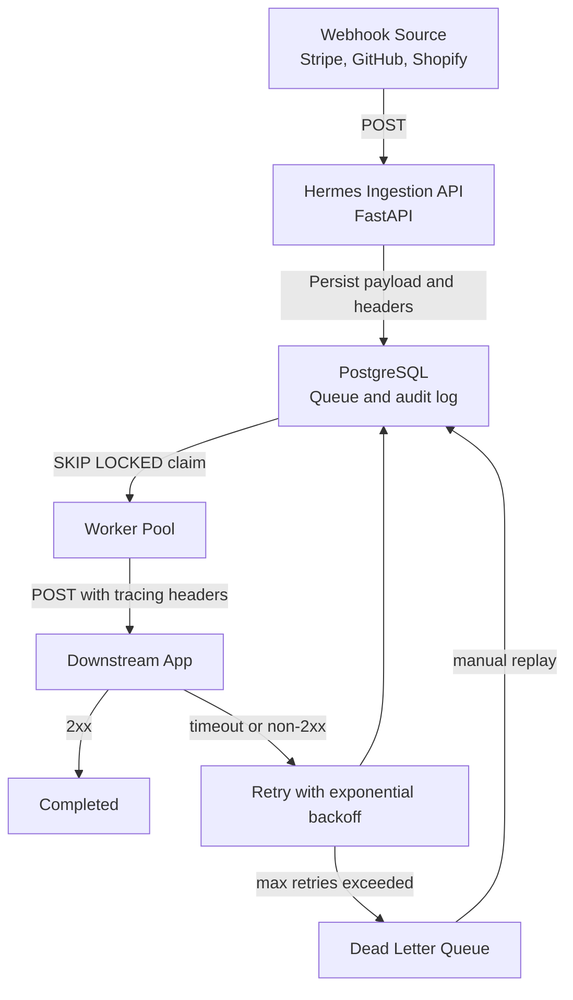

# Hermes

Guaranteed webhook delivery middleware for teams that need reliable event intake while their downstream apps deploy, fail, or slow down.

Hermes sits between webhook publishers such as Stripe, Shopify, Twilio, GitHub, or internal services and your application. It accepts webhook requests immediately, stores them durably in PostgreSQL, and delivers them asynchronously with concurrent workers, exponential backoff, delivery logs, and manual replay from a developer console.

## Why It Exists

Webhook providers usually expect your endpoint to be online and fast. If your app is restarting, overloaded, or temporarily broken, events can be lost or require manual recovery. Hermes gives you a lightweight self-hosted buffer without requiring Redis, RabbitMQ, or Kafka for the MVP path.

## Architecture

Hermes uses PostgreSQL as both state store and queue. Workers claim jobs atomically with `SELECT ... FOR UPDATE SKIP LOCKED`, allowing multiple workers to process pending webhooks without double-delivery from the queue.



## Features

- Durable ingestion endpoint that returns quickly after writing to PostgreSQL.
- Concurrent worker pool using Postgres row locking and `SKIP LOCKED`.
- Exponential retry backoff with configurable retry limits.
- Dead letter queue for permanently failed webhooks.
- Manual replay endpoint and dashboard action.
- Header preservation with Hermes tracing headers.
- Idempotency support using `Idempotency-Key` or `X-Hermes-Idempotency-Key`.
- Fan-out routing to multiple destinations from one incoming event.
- Simple destination filtering with expressions such as `event.type == 'payment.succeeded'`.
- Lightweight payload transformation with JSON field mapping.
- Optional Stripe, GitHub, or generic HMAC signature verification.
- Tenant-aware API keys and usage metrics for billing-style event counts.
- Structured JSON logs for ingestion, worker claiming, delivery, retry, DLQ, and replay events.
- Developer console for stats, filtering, inspection, payloads, headers, attempts, and replay.
- Optional `X-Hermes-API-Key` protection for API endpoints.
- Destination URL validation with optional host allowlisting and private-network blocking.
- Prometheus-style `/metrics` endpoint for operational visibility.

## Quickstart

Prerequisites:

- Docker
- Docker Compose

Start the stack:

```bash
docker-compose up --build
```

Services:

- PostgreSQL: `localhost:5432`
- Hermes API and dashboard: `http://localhost:8000`
- Fake downstream demo app: `http://localhost:9000`

Send a test webhook:

```bash
curl -X POST "http://localhost:8000/api/v1/ingest?url=https://httpbin.org/status/200" \
  -H "Content-Type: application/json" \
  -H "Idempotency-Key: payment-succeeded-2999" \
  -H "X-Custom-Auth-Signature: stripe_xyz123" \
  -d '{"event":"payment.succeeded","amount":2999}'
```

The API responds immediately with a webhook id while the worker delivers the payload in the background.

Run the full demo:

```bash
docker-compose exec hermes python scripts/demo.py
```

The demo checks health, queues a successful delivery to the fake downstream service, proves duplicate ingestion reuses the original webhook id, queues a failing delivery, shows retry state, requests replay, and prints current stats.

## Configuration

Copy `.env.example` to `.env` for local overrides.

Important settings:

| Variable | Purpose |
|---|---|
| `DATABASE_URL` | Async SQLAlchemy database URL used by the app. |
| `WORKER_CONCURRENCY` | Number of concurrent delivery workers. |
| `DEFAULT_MAX_RETRIES` | Number of delivery attempts before DLQ. |
| `BACKOFF_BASE_SECONDS` | Base interval for exponential backoff. |
| `HERMES_API_KEY` | Optional API key. When set, clients must send `X-Hermes-API-Key`. |
| `HERMES_API_KEYS` | Optional tenant API keys as `tenant_a:key_a,tenant_b:key_b`. |
| `ALLOW_PRIVATE_DESTINATIONS` | Allows local/private destinations for demos. Set `false` in production. |
| `DESTINATION_HOST_ALLOWLIST` | Optional comma-separated list of allowed destination hosts. |
| `STRIPE_WEBHOOK_SECRET` | Secret used when `signature_provider=stripe`. |
| `GITHUB_WEBHOOK_SECRET` | Secret used when `signature_provider=github`. |
| `HERMES_WEBHOOK_SECRET` | Secret used when `signature_provider=hermes`. |
| `AUTO_CREATE_TABLES` | Creates tables at startup for MVP/demo use. Production should use migrations. |

## Routing Examples

Fan out one event to multiple destinations:

```bash
curl -X POST "http://localhost:8000/api/v1/ingest?url=http://localhost:9000/ok&urls=http://localhost:9000/ok?copy=analytics" \
  -H "Content-Type: application/json" \
  -H "Idempotency-Key: evt_123" \
  -d '{"event":{"id":"evt_123","type":"payment.succeeded","amount":2999}}'
```

Filter before queueing:

```bash
curl -X POST "http://localhost:8000/api/v1/ingest?url=http://localhost:9000/ok&filter=event.type%20%3D%3D%20%27payment.succeeded%27" \
  -H "Content-Type: application/json" \
  -d '{"event":{"id":"evt_124","type":"payment.failed"}}'
```

Transform payload shape:

```bash
curl -X POST "http://localhost:8000/api/v1/ingest?url=http://localhost:9000/ok&transform=%7B%22id%22%3A%22event.id%22%2C%22type%22%3A%22event.type%22%7D" \
  -H "Content-Type: application/json" \
  -d '{"event":{"id":"evt_125","type":"payment.succeeded"}}'
```

Enable signature verification by setting the provider secret, then pass `signature_provider=stripe`, `signature_provider=github`, or `signature_provider=hermes` on ingest.

## API Reference

| Endpoint | Method | Description |
|---|---|---|
| `/api/v1/ingest?url=<URL>` | `POST` | Captures payload and headers, stores a webhook, and queues delivery. |
| `/api/v1/webhooks` | `GET` | Lists webhooks with pagination and optional `status` filtering. |
| `/api/v1/webhooks/{id}` | `GET` | Returns webhook details and delivery attempts. |
| `/api/v1/webhooks/{id}/replay` | `POST` | Resets a webhook and schedules immediate replay. |
| `/api/v1/stats` | `GET` | Returns dashboard aggregate counts and success rate. |
| `/api/v1/usage` | `GET` | Returns tenant event and unique-event usage counts. |
| `/metrics` | `GET` | Prometheus-style operational metrics. |
| `/health` | `GET` | Health check. |

## Development

Install backend dependencies:

```bash
cd backend
pip install -r requirements-dev.txt
```

Run tests:

```bash
python -m pytest
```

Run live API integration tests against a running Hermes instance:

```bash
set HERMES_TEST_BASE_URL=http://localhost:8000
python -m pytest tests/test_api_integration.py
```

On macOS/Linux:

```bash
HERMES_TEST_BASE_URL=http://localhost:8000 python -m pytest tests/test_api_integration.py
```

When run inside Docker Compose, the integration tests use `http://downstream:9000/ok` and `http://downstream:9000/fail` by default, so they do not depend on external services.

Run migrations for production-style schema management:

```bash
alembic upgrade head
```

Run the API locally:

```bash
uvicorn app.main:app --reload
```

## Resume-Ready Highlights

- Designed a reliable webhook delivery proxy with durable PostgreSQL queueing.
- Implemented concurrent workers using `SELECT ... FOR UPDATE SKIP LOCKED`.
- Added retry scheduling, dead letter handling, replay, and delivery audit logs.
- Built a full developer console with live polling and detailed delivery inspection.
- Added production-minded controls including API key enforcement, destination validation, idempotency, structured logs, metrics, config templates, tests, and CI.

## Interview Pitch

Hermes is a self-hosted webhook reliability layer. It accepts webhook events quickly, verifies optional provider signatures, persists them in PostgreSQL, fans out events to multiple destinations, filters and reshapes payloads, safely distributes delivery work across concurrent async workers using `SKIP LOCKED`, retries failed deliveries with exponential backoff, preserves dead-lettered events for inspection, and exposes replay, usage metrics, structured logs, and a dashboard for operations.
